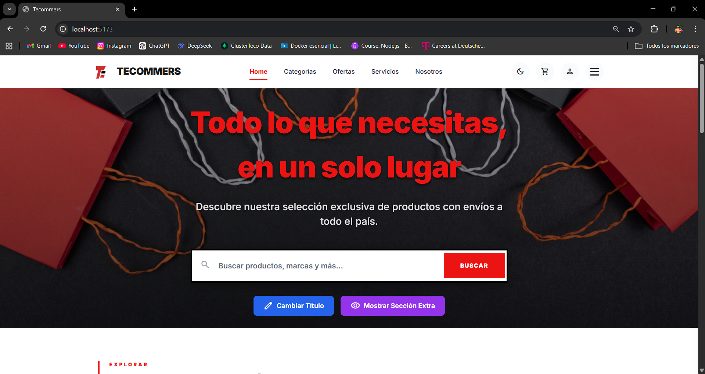
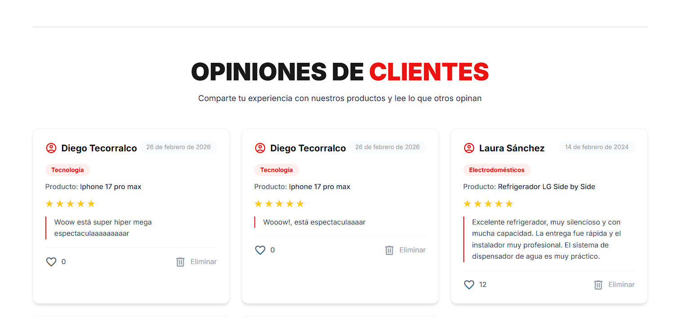
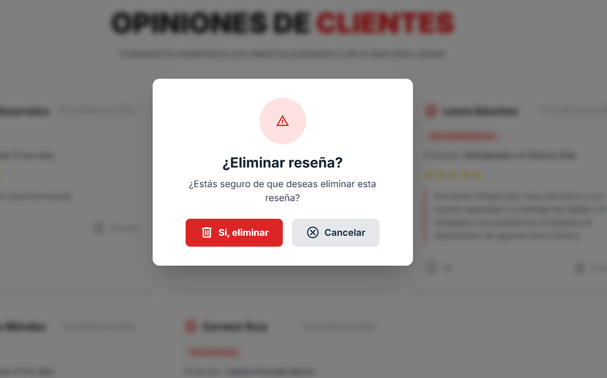
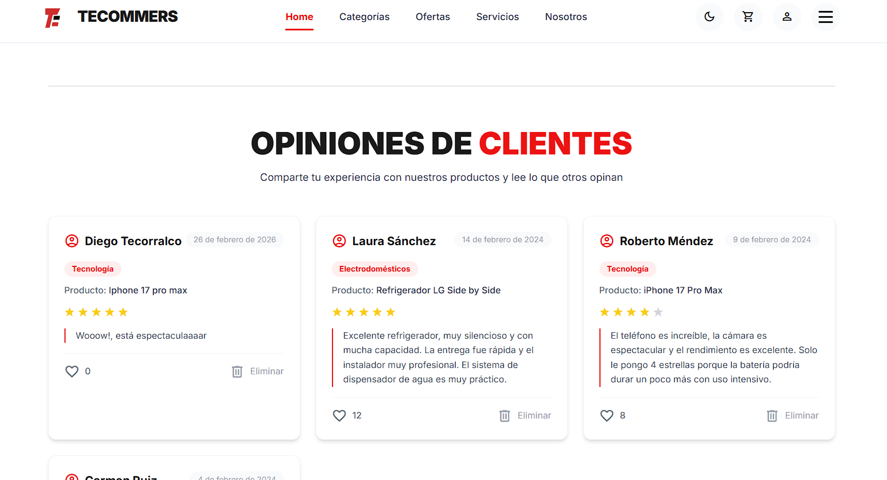

# Documento: Página Estática a Dinámica

### 1. ¿Qué es el DOM?

El **DOM (Document Object Model)** es una representación en forma de árbol de objetos de un documento HTML. Cuando el navegador carga una página web, crea este modelo estructurado donde cada etiqueta HTML se convierte en un **objeto** o **nodo**. JavaScript puede interactuar con estos nodos para cambiar el contenido, el estilo y la estructura de la página de forma dinámica.

---

### 2. ¿Cómo representa el navegador un documento HTML?

El proceso es el siguiente:

1.  **Recibe el HTML:** El navegador descarga el archivo HTML.
2.  **Construye el DOM (Parseo):** Lee el HTML línea por línea y construye el árbol del DOM, creando un nodo por cada etiqueta encontrada.
3.  **Construye el CSSOM (CSS Object Model):** Descarga y procesa los archivos CSS para crear otro árbol con la información de estilos.
4.  **Crea el Árbol de Render (Render Tree):** Combina el DOM y el CSSOM, incluyendo solo los elementos visibles en pantalla.
5.  **Pintado (Painting):** El navegador pinta los píxeles en la pantalla basándose en el árbol de render.

En resumen, el navegador transforma el texto plano de HTML en una estructura de objetos (el DOM) que puede ser estilizada y manipulada.

---

### 3. Diferencia entre `getElementById()`, `querySelector()` y `querySelectorAll()`

Estos son métodos que JavaScript proporciona para seleccionar elementos del DOM:

| Método | ¿Qué selecciona? |
| :--- | :--- |
| **`getElementById()`** | Un **único** elemento que tenga el `id` especificado. Es el método más rápido y específico. |
| **`querySelector()`** | El **primer** elemento que coincida con un selector CSS (clase, ID, etiqueta, etc.). |
| **`querySelectorAll()`** | Una **lista estática (NodeList)** de **todos** los elementos que coincidan con un selector CSS. |

---

### 4. ¿Qué es un evento en JavaScript?

Un **evento** es una acción o suceso que ocurre en el navegador, ya sea por parte del usuario o por el propio sistema. Ejemplos de eventos son: hacer clic en un botón, mover el ratón, escribir en un campo de texto, cargar la página, enviar un formulario, etc.

JavaScript puede "escuchar" estos eventos y ejecutar una función (llamada "event handler" o "listener") en respuesta.

---

### En Resumen

1.  **DOM:** El árbol de objetos de tu página.
2.  **Renderizado:** El proceso del navegador para convertir HTML en ese árbol y pintarlo.
3.  **Selectores:** Las herramientas de JavaScript para encontrar partes específicas de ese árbol.
4.  **Eventos:** Las acciones que ocurren en el navegador y a las que tu código puede reaccionar.

## Pruebas 
### Cambios para titulo 
**1- titulo original** 

**2- Cambio para el titulo en azul** 

**3- Cambio para el titulo en naranja** 

**4- Cambio para el titulo en morado** 

**5- Cambio para el titulo en verde** 

### Mostrar Contenido Extra
**1- mostrando el contenido extra**

### Agregar, eliminar cards

**1- Agregando Cards** 

**2- Eliminando las cards**

### Modo Claro Modo obscuro

**1- Modo Claro**

**2- Modo obscuro**

## Preguntas de Reflexión

### ¿Qué diferencia hay entre un sitio estático y uno dinámico desde la perspectiva del usuario?

Un sitio estático requiere recargar la página para mostrar cualquier cambio, lo que resulta en una experiencia entrecortada y lenta. Cada clic implica esperar a que el servidor responda con una nueva página completa.

Un sitio dinámico actualiza el contenido instantáneamente sin recargas visibles. El usuario puede cambiar el tema, filtrar productos o recibir notificaciones en tiempo real, disfrutando de una experiencia fluida similar a una aplicación de escritorio.

### ¿Cómo mejora la manipulación del DOM la experiencia del usuario?

La manipulación del DOM permite que la interfaz reaccione inmediatamente a las acciones del usuario. Los cambios de tema son instantáneos, los filtros muestran resultados mientras se escribe, y las notificaciones aparecen sin interrumpir la navegación. Todo esto crea una experiencia más ágil, intuitiva y satisfactoria.

### ¿Qué dificultades encontraste al manipular el DOM y cómo las superaste?

La principal dificultad fue lograr que todas las páginas respondieran consistentemente al cambio de tema, ya que cada una tenía sus propios estilos fijos. La solución fue crear un sistema centralizado con variables CSS y un contexto global para compartir el estado del tema.

Otro desafío fue identificar y reemplazar cientos de colores fijos en los componentes por variables dinámicas, un proceso minucioso pero necesario. También fue complicado lograr transiciones suaves entre modos, lo que se resolvió aplicando transiciones CSS globales.

La persistencia del tema entre sesiones se solucionó combinando localStorage con la detección de preferencias del sistema, asegurando una experiencia personalizada desde el primer momento.